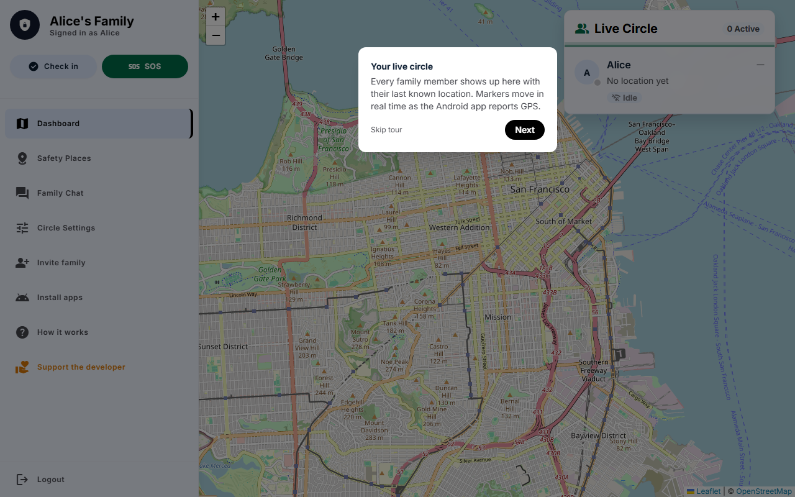
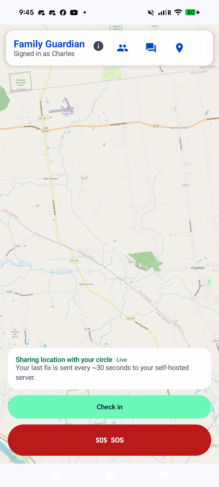
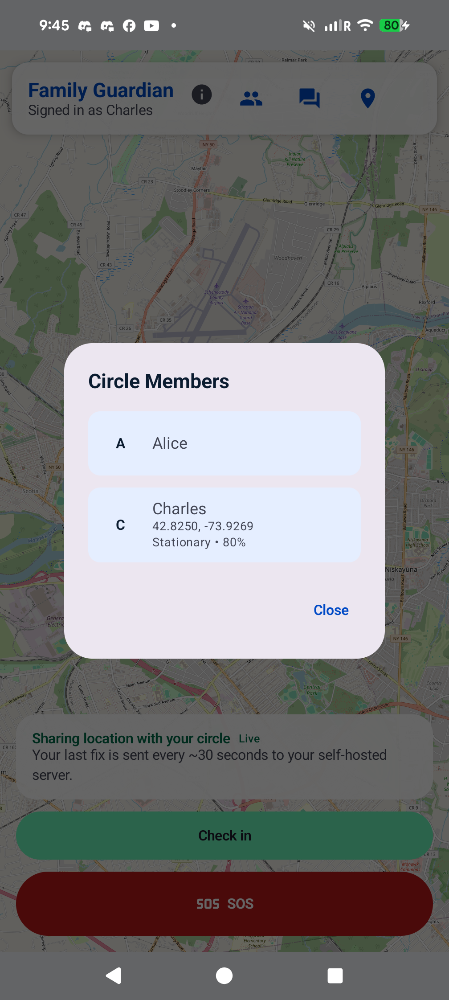
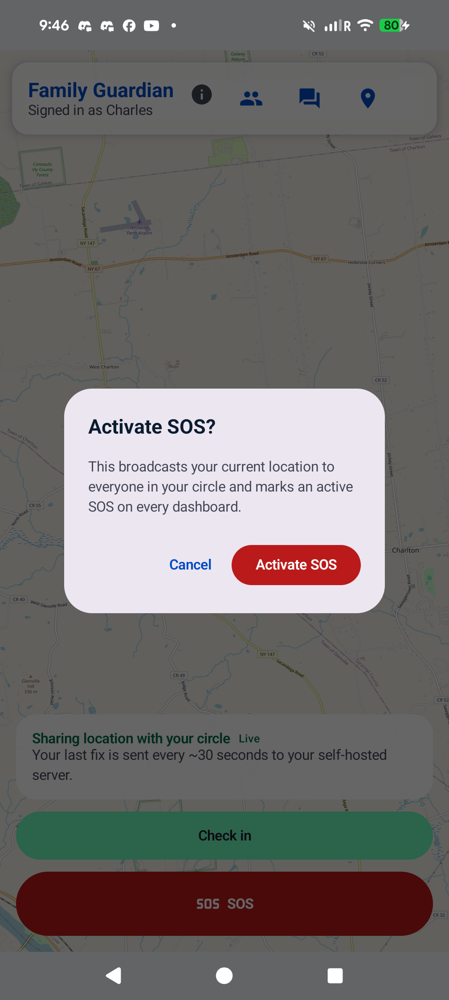
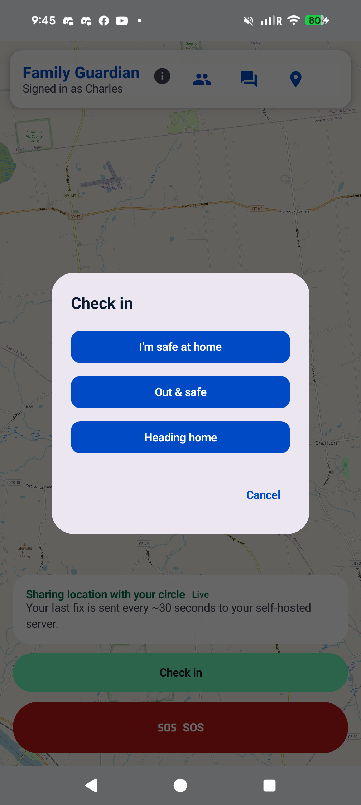
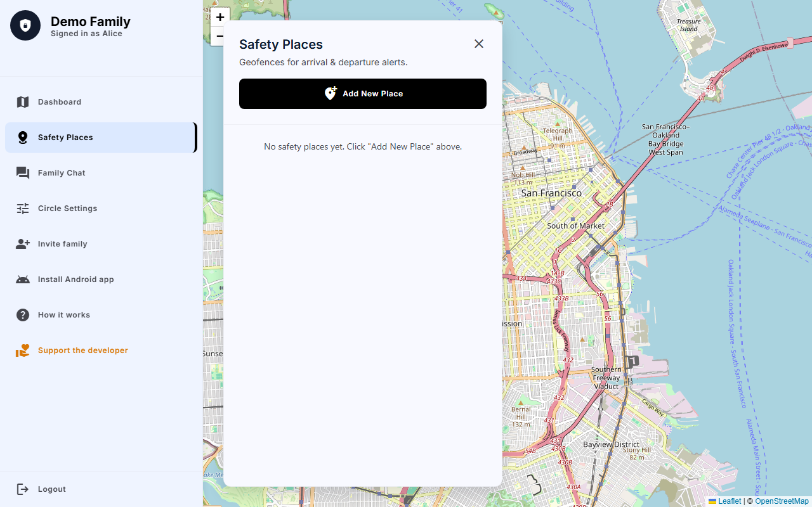

# Family Guardian

Self-hosted family safety platform — a Docker-deployed server, a native Kotlin **Android** app, an Expo **iOS** app (sideloadable IPA or build-from-source), and a fully-featured **PWA** for any browser. The server runs on infrastructure you control; location data never leaves your box.

📖 **Website:** <https://chartmann1590.github.io/family-guardian/> · 📦 **Releases:** [latest APK + IPA](https://github.com/chartmann1590/family-guardian/releases/latest)

> **Status:** walking skeleton with all core features shipped. End-to-end flow works (Android/iOS report GPS → server stores it → web map shows the marker move live). See "What's next" below for the roadmap.

## Screenshots

| Web dashboard | Android map | Android members |
| :---: | :---: | :---: |
|  |  |  |
| **Android SOS** | **Android check-in** | **PWA places** |
|  |  |  |

More screenshots in [`docs/screenshots/`](docs/screenshots/) and on the [project website](https://chartmann1590.github.io/family-guardian/).

```
+---------------------------+              +-------------------------+
|  Android app (Kotlin)     |  HTTPS+WS    |  Docker container       |
|  - Server URL + login     |<------------>|  Fastify + SQLite       |
|  - Background GPS         |              |  - REST + WebSocket     |
|  - osmdroid map           |              |  - Serves web dashboard |
+---------------------------+              |  - Volume: /data        |
                                           +-------------------------+
                                                     ^
                                                     | HTTPS
                                                     v
                                           +-------------------------+
                                           |  Web (browser)          |
                                           |  Leaflet + WebSocket    |
                                           +-------------------------+
```

## Quickstart — server

```bash
# from the repo root
docker compose up --build
```

Open <http://localhost:8080>. The very first request brings up a **bootstrap signup** form (one-time, creates the admin and an initial circle). Subsequent visits show the sign-in form.

After signing in you land on `/dashboard` — a Leaflet map with one marker per circle member. Markers move in real time as the Android app reports GPS.

## Quickstart — Android app

You have three options to install the Android app:

**Option A — download from GitHub Releases** (easiest, no build required):

Every push to `master` produces a tagged release at
[Releases](https://github.com/chartmann1590/family-guardian/releases/latest).
Grab the latest `family-guardian-<version>.apk`, transfer to the phone, and tap
to install. Allow "Install from unknown sources" for your browser/file manager.

**Option B — sideload a pre-built debug APK from your server**:

Use the one-shot build script — it assembles the Android debug APK, copies it into the server
build context, and rebuilds the Docker image:

```bash
node scripts/build-image.mjs
docker compose up -d
```

Then on the device's browser, open `http://<server-host>:8080/download` and install the APK
(allow "Install from unknown sources" for your browser). The image bakes the APK in at build
time; the server exposes it at `/download/family-guardian.apk` (with a QR code on the page).

**Sideload via ADB** (developer / homelab path — same APK, no browser):

```bash
adb install -r android/app/build/outputs/apk/debug/app-debug.apk
adb shell pm grant com.familyguardian android.permission.ACCESS_FINE_LOCATION
adb shell pm grant com.familyguardian android.permission.ACCESS_BACKGROUND_LOCATION
adb shell pm grant com.familyguardian android.permission.POST_NOTIFICATIONS
adb shell pm grant com.familyguardian android.permission.ACTIVITY_RECOGNITION
adb shell am start -n com.familyguardian/.MainActivity
```

Tested on a Pixel 8 Pro running Android 15. The foreground `LocationService` should appear in
`adb shell dumpsys activity services com.familyguardian` within a couple of seconds.

**Option C — build and run from Android Studio**:

1. Open `android/` in Android Studio (Hedgehog or newer). Let Gradle sync.
2. Run on a device or emulator with location services enabled.

On first launch, enter:
- **Server URL** — `http://10.0.2.2:8080` (Android emulator → host machine) or the LAN IP/HTTPS URL of your server.
- **Email + password** — the credentials you created during web signup.

Grant location + background-location + notification permissions when prompted.
The foreground service starts; within ~30s your marker appears on the web dashboard.

## Quickstart — iPhone clients

Family Guardian has **three** iPhone paths, from "no build" to "full Xcode":

### Option A — PWA (zero install, works in 30 seconds)

Open `http://<server-host>:8080/app` in Safari on the iPhone, sign in, then
**Share → Add to Home Screen**. The web app gives you full feature parity
(map, members, chat, places, alerts, SOS, check-ins). The only limitation iOS
imposes is **no reliable background GPS** — location only reports while the
PWA is open in the foreground. Great for parents/admins; use Option B or C
for users who need background tracking. Full guide:
[`docs/ios-pwa.html`](docs/ios-pwa.html) (also published at
<https://chartmann1590.github.io/family-guardian/ios-pwa.html>).

### Option B — Sideload the pre-built unsigned IPA (real background GPS, no Xcode)

1. Download the latest `FamilyGuardian-<version>-unsigned.ipa` from
   [Releases](https://github.com/chartmann1590/family-guardian/releases/latest).
2. Sign and install it on **Windows** with [Sideloadly](https://sideloadly.io/)
   or on **macOS** with [AltStore](https://altstore.io/) using a free Apple ID.
3. iOS trusts the signature for **7 days** with a free Apple ID — re-sign when
   prompted (Sideloadly and AltStore both have a one-click refresh). With a
   paid Apple Developer account the signature lasts a year.
4. On first launch, point the app at `http://<server-host>:8080`, sign in, and
   grant **Always** location + notification permissions.

Full guide with screenshots: [`docs/ios-native-sideloading.html`](docs/ios-native-sideloading.html)
(also at <https://chartmann1590.github.io/family-guardian/ios-native-sideloading.html>).

### Option C — Build from source (requires a Mac + Xcode)

If you'd rather build the IPA yourself — useful if you want to tweak features,
swap signing identities, or sign with your own Apple Developer Program account
for a year-long install:

```bash
# On a Mac with Xcode 15+ installed
cd ios-app
npm install
npx expo prebuild --platform ios --clean
cd ios
pod install        # only the first time
open FamilyGuardian.xcworkspace
```

In Xcode: **Signing & Capabilities → Team** → pick your free Apple ID or paid
team. Plug your iPhone in, select it as the run destination, and hit ▶. Xcode
installs the app directly via the device's developer mode (Settings → Privacy &
Security → Developer Mode on iOS 16+). Re-sign cadence is the same as Option B:
7 days for free Apple ID, 1 year for a paid Apple Developer Program account.

Full guide: [`docs/ios-build-from-source.html`](docs/ios-build-from-source.html).

## Downloads

Each push to `master` produces a versioned GitHub release with both the Android
APK and the iOS IPA attached. Find them at
[Releases](https://github.com/chartmann1590/family-guardian/releases/latest).

## Configuration

| Env var           | Default                | Notes                                      |
| ----------------- | ---------------------- | ------------------------------------------ |
| `PORT`            | `8080`                 | HTTP listen port                           |
| `HOST`            | `0.0.0.0`              | Bind address                               |
| `DATABASE_PATH`   | `/data/guardian.db`    | SQLite file inside the Docker volume       |
| `SESSION_SECRET`  | `change-me-…`          | Cookie signing secret. **Required when `NODE_ENV=production`** (server refuses to boot if left as default). |
| `NODE_ENV`        | unset                  | Set to `production` to require `SESSION_SECRET` and mark the session cookie `Secure` (HTTPS only). |
| `LOG_LEVEL`       | `info`                 | Pino log level                             |
| `FCM_SERVICE_ACCOUNT_PATH` | unset        | Path to Firebase service account JSON. When unset, push notifications are disabled. |
| `NOMINATIM_DISABLED` | unset          | Set to `1` to skip reverse-geocoding visits/trips. Labels remain `null`; no outbound HTTP. |
| `NOMINATIM_USER_AGENT` | `family-guardian-selfhosted (…)` | Sent as `User-Agent` to Nominatim. Set to something identifying *your* deployment (Nominatim ToS). |
| `NOMINATIM_URL`      | OSM public Nominatim   | Override to point at a self-hosted Nominatim instance. |

For local dev outside Docker, copy `server/.env.example` to `server/.env`.

### TLS

The container speaks plain HTTP. Put Caddy / nginx / Traefik in front and terminate TLS there. The Android app permits cleartext for the skeleton — switch to HTTPS before you deploy outside your LAN.

### Push notifications (optional)

Family Guardian works without push notifications — the WebSocket connection handles all real-time events while the app is open. Push notifications are only needed when the Android app is killed or in deep sleep.

To enable FCM push notifications:

1. Create a Firebase project at <https://console.firebase.google.com>.
2. Go to **Project Settings → Service Accounts** and generate a new private key JSON file.
3. Set the env var `FCM_SERVICE_ACCOUNT_PATH` to the path of that JSON file (e.g. mount it into the Docker container).
4. Download `google-services.json` from **Project Settings → General → Your apps → Android** and place it at `android/app/google-services.json`.
5. Add the `com.google.gms.google-services` plugin to the Android project's root `build.gradle.kts`:
   ```kotlin
   id("com.google.gms.google-services")
   ```
6. Rebuild the Android app.

Without `FCM_SERVICE_ACCOUNT_PATH`, the server logs "FCM disabled" once and continues normally. All WebSocket features (location updates, SOS, chat, geofences, check-ins) still work.

## API surface (skeleton)

| Method | Path                          | Auth | Purpose                                       |
| ------ | ----------------------------- | ---- | --------------------------------------------- |
| POST   | `/api/auth/signup`            | —    | Bootstrap admin (first call) or join via code |
| POST   | `/api/auth/login`             | —    | Returns `{token, userId, circleId}`           |
| POST   | `/api/auth/logout`            | ✓    | Destroys session                              |
| GET    | `/api/auth/me`                | ✓    | Current session info                          |
| PATCH  | `/api/users/me`               | ✓    | Update display name                           |
| POST   | `/api/users/me/photo`         | ✓    | Upload profile photo (multipart, ≤ 2 MB, JPG/PNG/WebP) |
| DELETE | `/api/users/me/photo`         | ✓    | Remove profile photo                          |
| GET    | `/api/users/:id/photo`        | ✓    | Fetch a circle member's photo                 |
| POST   | `/api/users/me/fcm-token`     | ✓    | Register a Firebase Cloud Messaging token     |
| POST   | `/api/circles/:id/invite`     | ✓    | Admin-only; generate one 8-char code, 24h expiry |
| GET    | `/api/circles/:id/invites`    | ✓    | Admin-only; list outstanding invite codes     |
| DELETE | `/api/invites/:code`          | ✓    | Admin-only; revoke an unused code             |
| POST   | `/api/locations`              | ✓    | Upsert current GPS fix                        |
| GET    | `/api/circles/:id/members`    | ✓    | Roster + last-known location per member       |
| GET    | `/api/circles/:circleId/members/:userId/history` | ✓ | Location history for a member (time-ranged) |
| GET    | `/api/circles/:id/places`     | ✓    | List safety places (geofences)                |
| POST   | `/api/circles/:id/places`     | ✓    | Create a geofence                             |
| PATCH  | `/api/places/:id`             | ✓    | Update a geofence                             |
| DELETE | `/api/places/:id`             | ✓    | Delete a geofence                             |
| POST   | `/api/sos/activate`           | ✓    | Trigger an SOS for the current user           |
| POST   | `/api/sos/:id/resolve`        | ✓    | Owner or admin can resolve                    |
| GET    | `/api/circles/:id/sos`        | ✓    | List active SOS events for the circle         |
| GET    | `/api/circles/:id/messages`   | ✓    | Family chat history (ASC), paginate via `before` + `limit` |
| POST   | `/api/circles/:id/messages`   | ✓    | Send a chat message; broadcasts over WS       |
| POST   | `/api/checkins`              | ✓    | Submit a check-in (safe_home / out_safe / heading_home) |
| GET    | `/api/circles/:id/checkins`  | ✓    | Latest check-ins for the circle             |
| GET    | `/api/circles/:id/visits`    | ✓    | Recent visits (closed stays) across the circle, joined with place names |
| GET    | `/api/circles/:circleId/members/:userId/visits` | ✓ | Per-member visit log, range-filtered |
| GET    | `/api/circles/:circleId/members/:userId/trips`  | ✓ | Per-member trip log (driving/walking segments) |
| GET    | `/api/users/me/alert-prefs`  | ✓    | Read the caller's alert thresholds          |
| PATCH  | `/api/users/me/alert-prefs`  | ✓    | Update speeding/low-battery/offline alert prefs |
| GET    | `/api/circles/:id/alerts`    | ✓    | Recent `alert_events` for the circle (speeding/low_battery/offline) |
| GET    | `/api/users/me/pause`        | ✓    | Read caller's current pause state           |
| POST   | `/api/users/me/pause`        | ✓    | Pause sharing for `{durationMinutes, reason?}` (1–1440 min) |
| DELETE | `/api/users/me/pause`        | ✓    | Resume sharing immediately                  |
| GET    | `/api/users/me/view-log`     | ✓    | List who recently viewed your history/visits/trips (`?days=` ≤ 30) |
| GET    | `/api/users/me/export`       | ✓    | Download a JSON of all your data (1/day)    |
| DELETE | `/api/users/me`              | ✓    | Delete account; body `{password}`; 409 if you're a sole admin with co-members |
| POST   | `/api/circles/:id/admins/:userId` | ✓ | Admin-only; promote a member to admin (for handoff) |
| GET    | `/ws`                         | ✓    | WebSocket upgrade (auth via cookie or `Authorization: Bearer`); emits `location_update`, `geofence_*`, `sos_active`, `sos_resolved`, `chat_message`, `check_in`, `pause_changed` |
| GET    | `/member/:userId`             | cookie | Web member detail page with route history      |
| GET    | `/welcome`                    | cookie | Post-signup wizard: display name + photo + first invite |
| GET    | `/healthz`                    | —    | Liveness probe                                |

Auth is opaque bearer tokens (Authorization header for the mobile app, HttpOnly cookie for the web).

## Repo layout

```
server/         Node.js + Fastify backend (Docker image)
  src/
    index.js              bootstrap
    db.js                 SQLite + migrations
    auth.js               argon2id + sessions
    hub.js                WebSocket pub/sub
    geofence.js           haversine enter/exit detection
    routes/               auth, checkins, circles, locations, messages, places, profile, sos, web, ws
    views/                login.html, dashboard.html, chat.html, places.html, settings.html, member.html
    public/app.js         dashboard client (Leaflet + WS)
    public/chat.js        chat client
    public/places.js      places editor client
    public/settings.js    settings/invite client
    public/member.js      member detail + history client
    migrations/001_init.sql through 007_checkins.sql

android/        Native Kotlin + Jetpack Compose app
  app/src/main/java/com/familyguardian/
    MainActivity.kt
    ui/                   ServerConfigScreen, MapScreen, ChatScreen, PlacesScreen, MemberDetailScreen
    data/                 Prefs, ApiClient, AuthRepo, ChatRepo, CheckinRepo, PlacesRepo, SosRepo, HistoryRepo, ProfileRepo, Models
    location/             LocationService (foreground), LocationReporter
    events/               EventStreamClient, GuardianEvent, EventBus, Alerts

mobile app/     Original HTML design prototypes (unchanged, reference)
website/        Original HTML design prototypes (unchanged, reference)
```

## What's next

All core features are shipped:
- ✅ Safety places / geofences (web + Android) — `places` table, CRUD endpoints, haversine enter/exit detection, live `geofence_enter` / `geofence_exit` events.
- ✅ Invites + multi-member circles — admin Settings page with code generation + revoke + copy-to-clipboard; web login form has a "Join with code" tab; Android sign-in screen has the same.
- ✅ SOS — `sos_events` table, activate/resolve/list endpoints, server falls back to last-known location, web dashboard shows a red top banner + pulsing red map marker for the SOS originator; admin or owner can resolve. Android SOS button fires `/api/sos/activate` with a confirmation dialog and a one-shot high-accuracy fix.
- ✅ Android event stream + system notifications — `EventStreamClient` (OkHttp WebSocket) lives inside the foreground `LocationService`, reconnects with exponential backoff, decodes events into a `GuardianEvent` sealed class, and emits Android notifications: HIGH-priority heads-up for SOS (tap → opens the location in Maps), DEFAULT for geofence arrivals/departures. Self-originated events are filtered out.
- ✅ Family chat — `messages` table, POST/GET endpoints, `chat_message` WS events, web chat page, Android chat screen with day headers and live WS feed.
- ✅ Location history + member details — `locations_history` table (append-only alongside the upsert `locations` table), `GET /api/circles/:id/members/:userId/history` with time-range filtering, web member detail page at `/member/:userId` with Leaflet path polyline + time range selector + device health stats, Android `MemberDetailScreen` with osmdroid path rendering and range selector.
- ✅ Profile photos — upload/display on web dashboard, chat, and Android.
- ✅ Onboarding wizard — post-signup photo + display name + invite generation.
- ✅ Kid's check-in — one-tap status signals (safe at home / out & safe / heading home) on web and Android.
- ✅ Open source readiness — AGPLv3 license, CI (GitHub Actions), test suite (vitest), ESLint + Prettier.

Recently added (movement + insights):
- ✅ **Movement detection** — Android uses the Activity Recognition API with a speed-threshold fallback to label every fix as `still / walking / running / cycling / driving`. Persisted on `locations` + `locations_history`; surfaced as an icon + label on the dashboard and a coloured polyline (red = driving, green = walking, grey = stationary) on the member page.
- ✅ **Speed display in mph or km/h** — both web and Android pick the unit from the device/browser locale (`en-US` → mph, anything else → km/h). See `server/src/public/units.js` and `android/.../ui/Units.kt`.
- ✅ **Visits + dwell duration** — server keeps an in-memory live-visit cache (`server/src/visits.js`) backed by a `visits` table; a stay is closed when the user moves consistently for ~2 fixes. Known places (geofences) are linked via `place_id`; auto-detected stays get reverse-geocoded labels via Nominatim. Browse a member's last 7 days of visits on the Android **Visits** screen or the **Visits** tab on `/member/:id`.
- ✅ **Trip summaries** — every moving segment is captured in a `trips` table with distance, max/avg speed, and a `driving / walking / running / cycling / mixed` mode pulled from the activity stream. Trips appear on the same Android screen and the **Trips** tab.
- ✅ **Speeding alert** — fires (with 5-min debounce) when a driving user crosses the configurable `speeding_threshold_mps` (default ~70 mph). WS event `speeding_alert` + system notification.
- ✅ **Low-battery alert** — fires on the falling-edge crossing of the threshold (default 15%). WS event `low_battery_alert`.
- ✅ **Offline / stale alert** — a 60s scheduler scans `locations` and fires `offline_alert` for users who haven't reported in `offline_minutes` (default 30).
- ✅ **Per-user alert preferences** — every alert type can be toggled and its threshold tuned from the Android **Alert settings** screen (`PATCH /api/users/me/alert-prefs`).

Recently added (Sprint 1 — privacy & control):
- ✅ **Pause sharing (soft pause)** — Freeze your last-known location on the circle's map for 15 min / 1 hr / 4 hr / "Until 8 PM" / custom from the PWA Settings page, the Android map header, or the iOS More tab. The circle sees a ⏸ badge + the time you'll resume, never your live position. `locations_history` continues to record fixes so your own timeline stays intact; the in-process scheduler auto-expires pauses and broadcasts `pause_changed` over WS.
- ✅ **Audit log of who viewed you** — every read of another member's history / visits / trips / member page is logged (5-minute debounce per (viewer, subject, resource)). `GET /api/users/me/view-log?days=N` returns rows where you are the subject — you can only see views *of you*, never others. Surfaced on the Android **Who viewed your history** screen and a section on the PWA Settings page.
- ✅ **Data export + account deletion** — `GET /api/users/me/export` returns a JSON attachment with everything the server has on you (locations history, visits, trips, messages, check-ins, SOS, alerts, places, view audits; rate-limited 1/day). `DELETE /api/users/me` (with password re-confirm) wipes you; returns 409 with `requires_admin_handoff` if you are the sole admin with co-members, in which case `POST /api/circles/:id/admins/:userId` lets you promote a successor.

Privacy notes:
- Reverse geocoding hits the public OSM Nominatim service. Each lookup is rate-limited (≤1 req/sec) and cached in `geocode_cache`, but if you'd rather keep all addresses local set `NOMINATIM_DISABLED=1` (or point `NOMINATIM_URL` at your own Nominatim instance). When disabled, visits keep a `lat,lng` label only.
- Android needs the `ACTIVITY_RECOGNITION` runtime permission for activity detection. Denial is non-fatal — the server falls back to inferring `walking / driving` from the GPS speed.

Still on the table:
- FCM push notifications (optional) — would allow notifications when the Android app is killed
- HTTPS termination inside the container (optional)

---

## ☕ Support the Project

If Family Guardian is useful to your family, consider buying the developer a coffee — it helps cover server costs and fuels new features.

[](https://buymeacoffee.com/charleshartmann)
